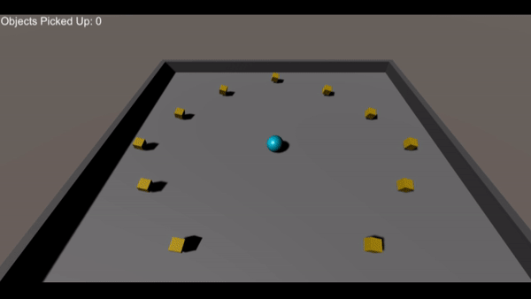
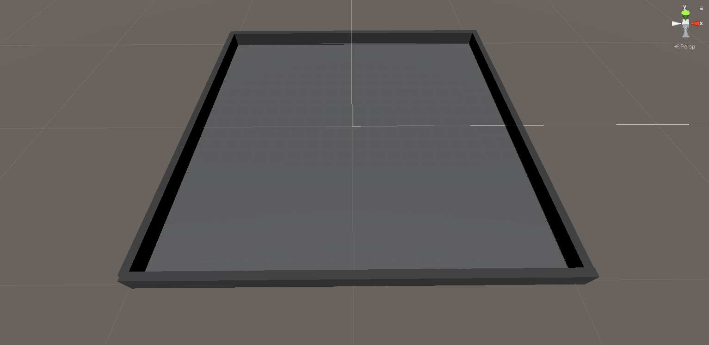
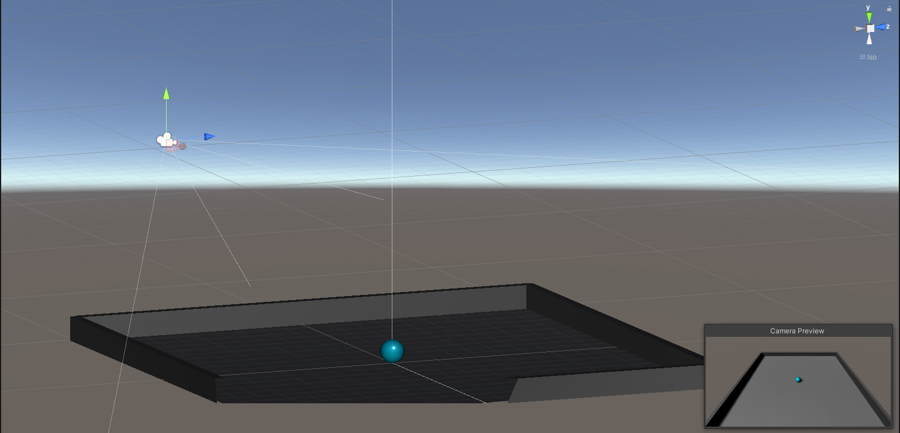
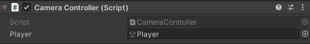
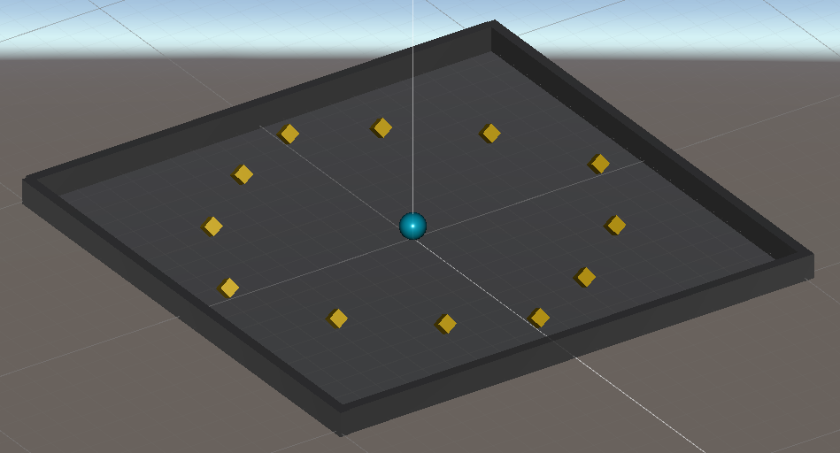
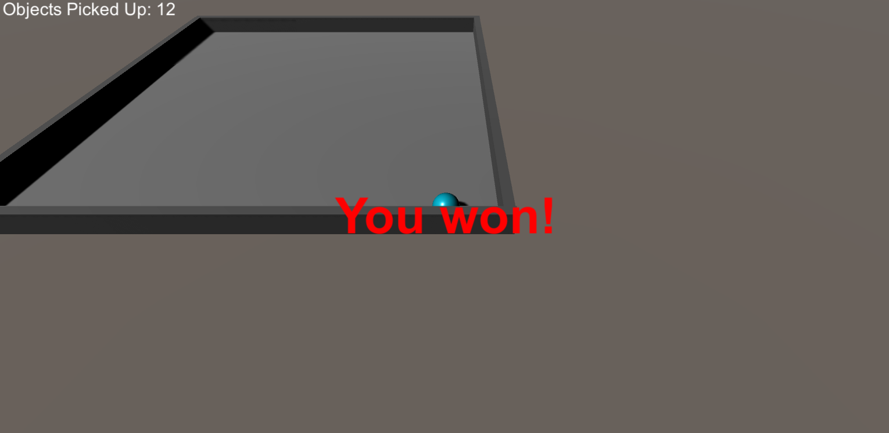

---

layout: course
title: A&VR TD1
---

# TD1 Unity: "Roll-a-ball" game

Adapted from an official Unity tutorial by Arnaud Prouzeau.

The goal of the game is to roll a ball around an arena to collect all cubes.

## Preparation

Create a new Unity project. Any version of Unity can be used.

## Step 1: Creating the scene

Create the arena. It must consist of a plane for the ground and 4 scaled cubes for the walls.

To change the color of the scene's elements, create a new ``Material`` and apply it to the ``GameObject``.

<a href = "https://docs.unity3d.com/Manual/Materials.html" target = "_blank">Unity documentation for Materials</a>

## Step 2: Creating the ball

Create a sphere to represent the player's ball. Add a ``Rigidbody`` component to use the physics engine to apply forces to the ball.

Create a script to manage the ball's movements.

In the ``Start`` function, you can retrieve the ``Rigidbody`` component using the ``GetComponent<Rigidbody>()`` function. 

<a href = "https://docs.unity3d.com/Manual/class-Rigidbody.html" target = "_blank">Unity documentation for RigidBody</a>

The ``Update`` function allows us to retrieve the directional keys pressed by the user and modify the ball's behavior accordingly.

Up/Down and Right/Left movements can be retrieved using the ``Input.GetAxis()`` function. <a href = "https://docs.unity3d.com/ScriptReference/Input.GetAxis.html" target = "_blank">Doc</a>

Next, we can create a ``Vector3`` that contains Right/Left movements (for x) and Up/Down movements (for z). This vector represents the final vector of forces to be applied to the ball.

Finally, we can use ``RigidBody``'s ``AddForce()`` function to apply the forces to the ball. <a href = "https://docs.unity3d.com/ScriptReference/Rigidbody.AddForce.html" target = "_blank">Doc</a>

If the ball's speed is too low, we can multiply the force vector by a ``float`` parameter representing the speed.

## Step 3: Camera motion

We're now going to make the camera follow the ball like in a third-person game.

To do this, we'll first position the camera so that it's in the right position at the start of the game.

Then, using a script, we can reposition the camera so that it is always fixed in relation to the ball.

In the script, we'll need a reference to the ball. To do this, we can declare a ``public`` ``Player`` attribute of type ``GameObject``. This allows us to link it to the ball directly in the editor.

The idea is then to recover the difference between the position of the ball and the camera in a ``Vector3`` (using ``transform.position`` - <a href = "https://docs.unity3d.com/ScriptReference/Transform-position.html" target = "_blank">Doc</a>). In the ``Update`` method, you can move the camera to keep this distance constant (still using ``transform.position``).

## Step 4: Create the collectibles

Create a cube to model the objects to be picked up. We'll add a ``Rigidbody`` to it. To prevent it from falling to the ground, we'll remove gravity and define it as ``Kinematic``, as we won't be using forces to make it move. Instead, we'll use a script to make it turn on itself.

Note: for the ball's collision with the cube to return an event, we need to define one as a ``Trigger`` in the ``BoxCollider`` component. Here, we can define the cube as a ``Trigger``.

By dragging and dropping the object into the Project interface, we can create a Prefab for our object. If we drag back multiples times the newly created Prefab from the Project interface to the Scene, every modification made to one of them, will affect the others

Create a scene with 12 cubes to pick up.

Using the ``OnTriggerEnter(Collider other)`` event, manage the collision between the ball and the objects to be picked up. You'll need to make the object disappear and keep track of the objects remaining on the stage. <a href = "https://docs.unity3d.com/ScriptReference/Collider.OnTriggerEnter.html" target = "_blank">Doc</a>

## Step 5: Graphic interface

Using a ``Canvas``, position a text at the top left of the screen with the number of objects already collected.

Add a text that appears when there are no more objects left to pick up.

## Step 6: New features

Add free features to the game.

Examples:
- Ball jumping (with high targets)
- Generation of random playing fields
- Add objects that must not be touched
- Temporary magic power
