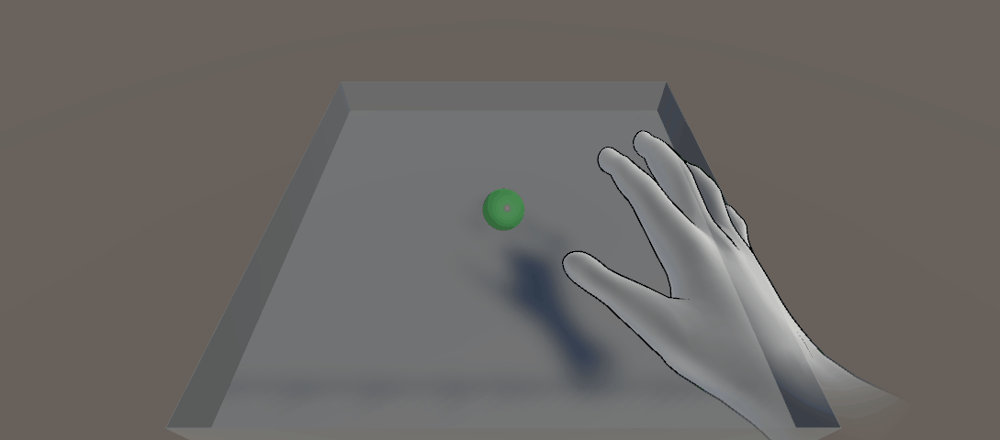
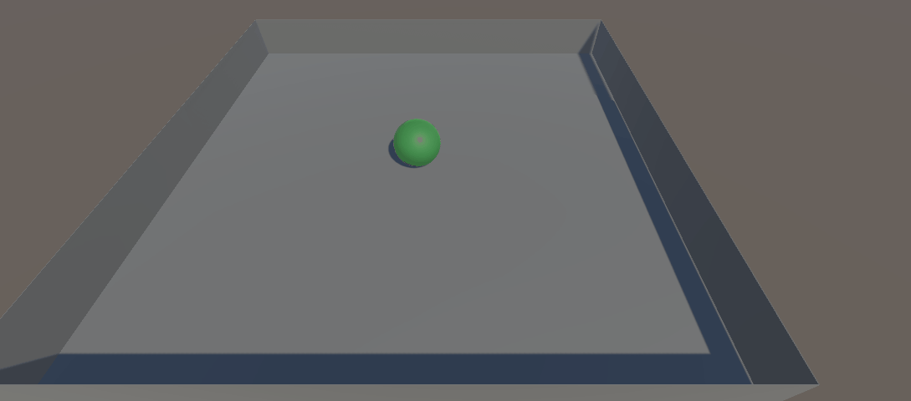

---

layout: course
title: A&VR TD3
---

# TD3 Leap Motion

In this practical work, the goal is to familiarize yourselves with the leap motion hand tracking camera. As only 6 leap motions are available, work by groups of 3 or 4. Choose one of the computers with the leap motion in front of it, and log in to the session of a group member. Ideally, chose the group member that best succeeded at implementing the Roll a Ball of previous practical works since you will be working from this project, but a Roll a ball with an arena and a moving sphere is enough.


## Step 0 - Ultraleap Tracking

Plug in your leap motion, and place it on your desk in front of your screen. Clear the desk around the leap motion in order to have some room to move your hands above it in the rest of this practical work. Launch the Ultraleap control panel application and move your hand above the leap motion to test that it is well connected.

## Step 1 - Roll-a-ball by hand

The goal of this section is to control the ball by pointing at the position you want the ball to go.

### Setting up Leap Motion in Roll-a-ball

Open a copy of the Roll-a-ball project you developped in the previous practical works. Follow the instruction at <a href="https://docs.ultraleap.com/xr-and-tabletop/xr/unity/getting-started/index.html#set-up-hand-tracking-in-unity" target="_blank">this adress</a> (from Set up hand tracking in Unity) to add ultraleap to your project. The Ultraleap hand tracking software is already installed on the computers.

Add the example content and open the Capsule Hands scene to test that hand tracking works.

Open the Physical hands Object Interaction scene and play it. Have each member of the group try the scene for a short time to familiarize yourselves with the leap motion.

### Adding hands to Roll-a-ball

Go back to the Roll-a-ball scene.

Add a desktop XR Leap Motion Service Provider to the scene. You can find it in ```Ultraleap > Tracking > Service Provider (desktop)```. From the same toolbar, add hands model as a child to the service provider. Ultraleap proposes several hand types, choose whichever you prefer.

Depending on the scale of your Roll-a-ball scene, the hands might be much too small or much too big. We thus need to scale the hands in order to be able to move the hand confortably on the whole size of your arena. You can either:
- scale the hands by changing uniformely the scale of the Service Provider's transform. However, some hand models will not react well to being scaled up or down and will be distorted.
- to avoid that, you can instead create an empty object, add all elements of your Roll-a-ball but the Service Provider as children, and scale up or down this empty to scale your scene.



### Detecting a hand

Our goal is to move the ball using the hand. Open the script controlling the motion of the ball, and follow the instructions at this page to link the script to the ultraleap service provider, in order to be able to detect the hands: <a href="https://docs.ultraleap.com/xr-and-tabletop/xr/unity/plugin/features/scripting-fundamentals.html#getting-hand-tracking-data" target="_blank">doc</a>.

The ```OnUpdateFrame``` function is now called at each update of Unity if the ultraleap service provider has data to display, i.e. if a hand is detected. Access the hand data detected in order to print a message with ```Debug.Log(msg)``` when the hand of your choice (left or right) is detected. <a href="https://docs.ultraleap.com/xr-and-tabletop/xr/unity/plugin/features/scripting-fundamentals.html#hand-details" target="_blank">doc</a>.

### Getting the position of a finger

Get the position of the tip of the index of the chosen hand. We will use this to point at the position we want the ball to move to. Access the index finger by using ```Finger[] fingers``` from UltraLeap ```Hand``` class.

<a href="https://docs.ultraleap.com/api-reference/unity-api/class/class_leap_1_1_hand.html" target="_blank">Documentation for ```Hand``` class</a>.

<a href="https://docs.ultraleap.com/api-reference/unity-api/class/class_leap_1_1_finger.html" target="_blank">Documentation for ```Finger``` class</a>.

### Moving the ball

You can now move the ball towards the position of the tip of the finger. To do that, you can project the position of the fingertip onto the arena (simply by setting the ```Y``` coordinate to 0), and create a ```Vector3``` containing the vector going from the current ball position to the projected position of the fingertip. You can finally use this ```Vector3``` as the force to apply to move the ball.

Adjust the parameters of the scene so that you can confortably play the game with this new modality (maximum speed of the ball, scale of the arena or of the hands, ...).


## Step 2 - Let's cheat! Grabbing the ball

Now that you are using one hand to point at where the ball must go, you could cheat at the game by grabbing the ball with the other hand... Add a new function ```GrabBall``` to the script, and call it when the hand not used in the previous section is detected.



Use the documentation of the ```Hand``` class (<a href="https://docs.ultraleap.com/api-reference/unity-api/class/class_leap_1_1_hand.html" target="_blank">here</a>) to detect when the hand is grabbing or pinching, and to detect the position of the ball relative to the hand. Use this information to detect when the ball is grabbed or pinched, and constrain the position of the ball to follow the hand while it is grabbed.

## Step 3 - To go further

Think of new interactions methods using the leap motion, and try to implement it! For example, you could:
- make the ball jump when you close a hand
- change the tilt of the arena based on the orientation of the palm of your hand, in order to move the ball with gravity
- have the ball preserve it's velocity when grabbed and let go, in order to be able to throw the ball
- ...